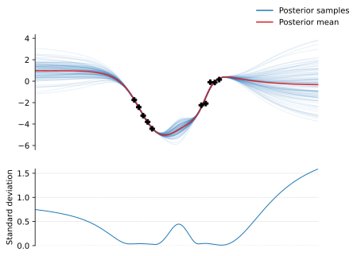
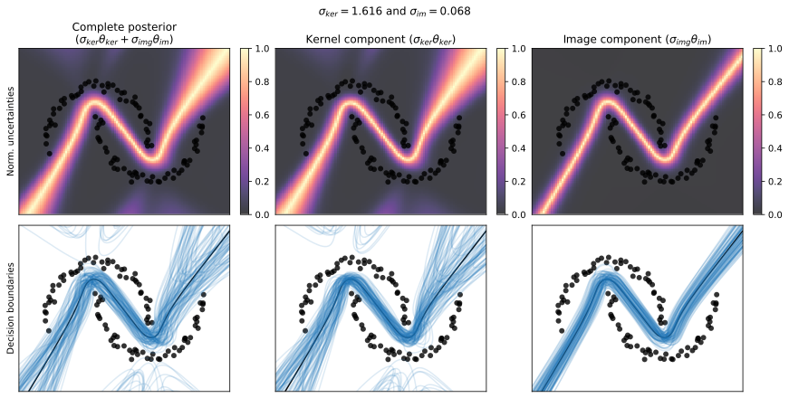

# VIKING: Variational Inference with Kernel- and Image-spaces of numerical Gauss--Newton matrices

This Python package implements [VIKING], a variational inference method for building scalable, fully-correlated posteriors of neural networks with a JAX-based API.

The library is designed to be agnostic to the neural network implementation. You should be able to use it with your favorite neural network library and the usual JAX transformations (`jax.jit`, `jax.vmap`).

## Documentation

Coming soon!

## Examples

The `examples/` directory contains a examples showing how to use the library, some mentioned below. After installing the project dependencies, the scripts can be run directly from a command line. Command-line options are available to tweak the models and VIKING, feel free to inspect them with the `--help` flag.

### Regression in plain JAX
(Found in `examples/sinusoid.py`)

This example uses this library to build a VIKING approximate posterior for a plain JAX implementation of a two-layer neural network.

### Classification on two moons data with Equinox
(Found in `examples/two_moons.py`)

This builds a VIKING approximate posterior of an MLP using [Equinox]. This includes the usual Equinox way of doing things, e.g., `eqx.filter_jit`.

[VIKING]: coming-soon
[Equinox]: https://docs.kidger.site/equinox/
