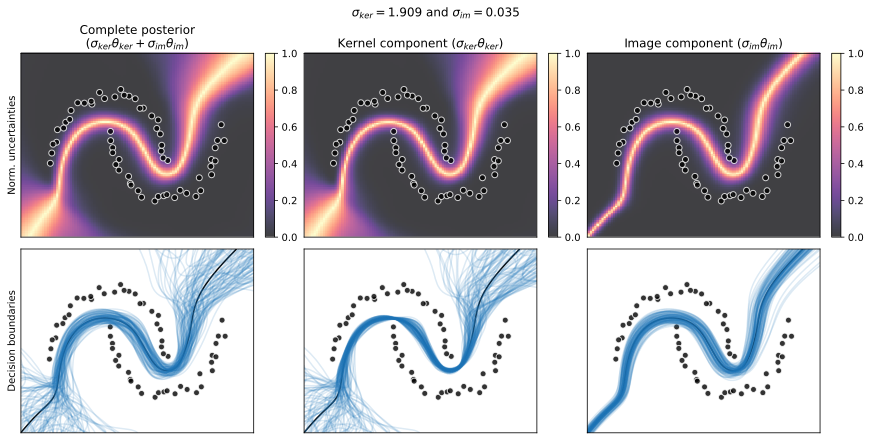

# 🥝 Kernel-Image Variational Inference (KIVI)

This Python package implements [KIVI] with a friendly API.

## Bird or Fruit? 🥝 vs 🐦‍⬛

To settle this once and for all: **KIVI is a fruit!** 🥝

While "kiwi" can refer to both the delicious fuzzy fruit and New Zealand's flightless bird, we've chosen the fruit emoji for our **K**ernel-**I**mage **V**ariational **I**nference project. Why? Because just like the kiwi fruit's vibrant green interior hidden beneath its humble exterior, our KIVI method reveals the rich mathematical structure hidden within kernel methods and variational inference.

## Documentation

Coming soon!

## Examples

The `examples/` directory contains a few examples implementing the method, including the one that produces the picture above. After installing the project dependencies, the scripts can be run directly from a command line without arguments, but command-line options are available to tweak the models and KIVI.

[KIVI]: coming-soon
